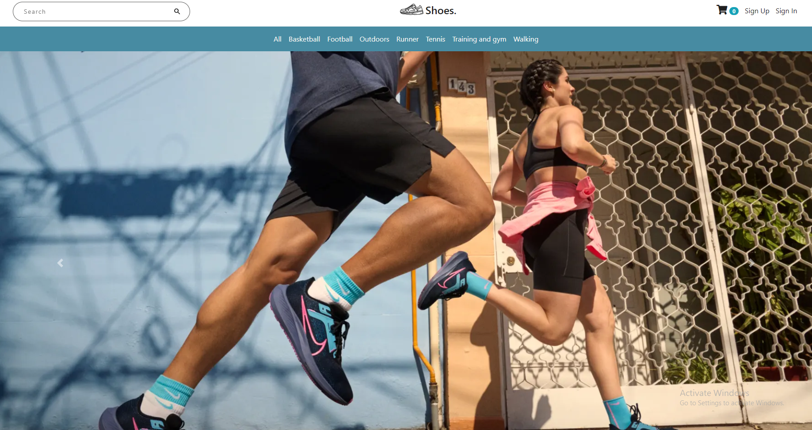

# SHOES

## Table of contents

[Introduction](#introduction)
[Demo](#demo)
[Technology](#technology)
[Features](#features)
[Database Models](#database)

## Introduction

A virtual ecommerce website for selling Shoes

## Demo

The website is just a fake one. If you want to use the checkout use the fake number provided by Stripe

## Technology

The application is built with:

- Node.js
- MongoDB 
- Express 
- Bootstrap 
- FontAwesome 
- Stripe API: used for payment in the checkout page
- Mapbox API: used to show the map in the about us page
- AdminBro: used and customized to implement the admin panel
- Nodemailer: used to send emails from the contact us form
- Passport: used for authentication
- Express Validator: used for form validation

## Features

The application displays a virtual Shoes store that contains virtual products and contact information.

Users can do the following:

- Create account, login or logout
- Browse available products added by the admin
- Add products to the shopping cart
- Delete products from the shopping cart
- Display the shopping cart
- To checkout, a user must be logged in
- Checkout information is processed using stripe and the payment is send to the admin
- The profile contains all the orders a user has made

Admins can do the following:

- Login or logout to the admin panel
- View all the information stored in the database. They can view/add/edit/delete orders, users, products and categories.

## Database

All the models can be found in the models directory created using mongoose.

### User Schema:

- username (String)
- email (String)
- password (String)

### Category Schema:

- title (String)
- slug (String)

### Product Schema:

- productCode (String)
- title (String)
- imagePath (String)
- description (String)
- price (Number)
- category (ObjectId - a reference to the category schema)
- manufacturer (String)
- available (Boolean)
- createdAt (Date)

### Cart Schema:

- items: an array of objects, each object contains:  
  - productId (ObjectId - a reference to the product schema)  
  - qty (Number)  
  - price (Number)  
  - title (String)  
  - productCode (Number)  
- totalQty (Number)
- totalCost (Number)
- user (ObjectId - a reference to the user schema)
- createdAt
    

### Order Schema:

- user
- cart 
- address (String)
- paymentId (String)
- createdAt (Date)
- Delivered (Boolean)
